# 🧪 Data Engineering Lab


맥북 환경에서 데이터 엔지니어링 학습 및 연구를 해보려고 만든 프로젝트 입니다.


## 🏗️ 디렉토리 구조 (Directory Structure)

본 프로젝트는 각 컴포넌트별로 독립된 환경을 제공하여 유지보수와 개별 테스트가 용이하도록 구성되어 있습니다.

```bash
.
├── create_network.sh        # 공통 브릿지 네트워크 생성 스크립트
├── kafka/                   # Kafka Cluster (KRaft Mode, 3 Nodes)
│   └── docker-compose.yml
├── mariadb/                 # Source DB & Data Generator
│   ├── docker-compose.yml
│   ├── gen_data.py          # 이커머스 트래픽 생성기
│   ├── mariadb/             # DB 설정 및 초기화 SQL
│   │   ├── conf.d/
│   │   └── init/
│   └── venv/                # Python 가상환경
├── devezium/                # CDC 엔진 (Debezium Connect)
│   ├── docker-compose.yml
│   └── register_connector.sh # 커넥터 등록 스크립트
├── starrocks/               # StarRocks (OLAP Engine)
│   ├── fe/                  # Front-End 클러스터
│   │   └── docker-compose.yml
│   └── be/                  # Back-End 클러스터
│       └── docker-compose.yml
└── README.md
```

---

## 🚀 Scenario #1: 고가용성 실시간 CDC 파이프라인

### 1. 시나리오 개요: "실시간 이커머스 분석 환경"
이 시나리오는 **가상의 이커머스 플랫폼**에서 발생하는 트래픽을 처리합니다. `gen_data.py`는 다음과 같은 사용자 행동을 시뮬레이션하며, 모든 변화는 실시간으로 StarRocks에 동기화됩니다.

* **회원 가입 (INSERT)**: 신규 유저가 생성됨 (가중치 20%)
* **상품 주문 (INSERT)**: 기존 유저가 특정 상품을 주문, `PENDING` 상태로 저장 (가중치 70%)
* **배송 처리 (UPDATE)**: 주문 상태가 `PENDING`에서 `SHIPPED`로 변경됨
* **주문 취소 (DELETE)**: 고객의 요청으로 주문 데이터가 삭제됨


### 2. 아키텍처 (Architecture)

```mermaid
graph LR
    subgraph Source_Layer [OLTP: Business Handling]
        GEN[Python Traffic Generator]
        DB_ST[MariaDB Storage]
        BIN[MySQL Binlog]
        
        GEN -- "1. 가입/주문/취소" --> DB_ST
        DB_ST -- "2. 변경분 기록" --> BIN
    end

    subgraph Ingestion_Layer [CDC: Real-time Capture]
        DEB[Debezium Connect]
        BIN -- "3. 로그 스캔" --> DEB
    end

    subgraph Streaming_Layer [Kafka: KRAFT]
        K1[Kafka Broker 1]
        K2[Kafka Broker 2]
        K3[Kafka Broker 3]
        
        DEB -- "4. 이벤트 발행" --> K1
        DEB -- "4. 이벤트 발행" --> K2
        DEB -- "4. 이벤트 발행" --> K3
    end

    subgraph Analytics_Layer [OLAP: Real-time Analytics]
        RL[StarRocks Routine Load]
        FE[StarRocks FE Cluster]
        BE[StarRocks BE Cluster]

        K1 & K2 & K3 -- "5. Topic 소비" --> RL
        RL -- "6. 파싱 및 분배" --> FE
        FE -- "7. 저장 및 분석" --> BE
    end

    %% 블랙 테마를 위한 스타일 설정
    style GEN fill:#1a237e,stroke:#5c6bc0,stroke-width:2px,color:#ffffff
    style DB_ST fill:#01579b,stroke:#03a9f4,stroke-width:2px,color:#ffffff
    style BIN fill:#1b5e20,stroke:#66bb6a,stroke-width:2px,color:#ffffff
    style DEB fill:#4a148c,stroke:#ab47bc,stroke-width:2px,color:#ffffff
    style K1 fill:#311b92,stroke:#7e57c2,stroke-width:2px,color:#ffffff
    style K2 fill:#311b92,stroke:#7e57c2,stroke-width:2px,color:#ffffff
    style K3 fill:#311b92,stroke:#7e57c2,stroke-width:2px,color:#ffffff
    style RL fill:#b71c1c,stroke:#ef5350,stroke-width:2px,color:#ffffff
    style FE fill:#e65100,stroke:#ffa726,stroke-width:2px,color:#ffffff
    style BE fill:#e65100,stroke:#ffa726,stroke-width:2px,color:#ffffff
```



---

### 3. 배포 및 실행 가이드 (Deployment)

반드시 아래 순서대로 실행하여 의존성을 확보하십시오.

#### **Step 1. 인프라 네트워크 생성**
```bash
./create_network.sh
# 또는 직접 실행: docker network create --driver bridge --subnet=10.100.0.0/16 dataplatform-net
```

#### **Step 2. 메시지 브로커 (Kafka) 실행**
```bash
cd kafka && docker-compose up -d && cd ..
```

#### **Step 3. 소스 데이터베이스 (MariaDB) 실행**
```bash
cd mariadb && docker-compose up -d && cd ..
```

#### **Step 4. CDC 엔진 (Debezium) 실행 및 커넥터 등록**
```bash
cd devezium && docker-compose up -d
# 잠시 후 커넥터 등록 (REST API 호출)
./register_connector.sh
cd ..
```

#### **Step 5. 분석 엔진 (StarRocks) 실행**
```bash
# FE 먼저 실행 후 BE 실행
cd starrocks/fe && docker-compose up -d && cd ../..
cd starrocks/be && docker-compose up -d && cd ../..
```

---

### 4. 트래픽 생성 및 실시간 데이터 확인

#### **데이터 생성기 실행**
Python 가상환경을 활성화하고 MariaDB에 무작위 트래픽을 발생시킵니다.
```bash
cd mariadb
source venv/bin/activate
python gen_data.py
```
* `[USER] Created`: 신규 유저 발생
* `[ORDER] New Order!`: 주문 데이터 발생
* `[UPDATE] Order status changed`: 배송 상태 동기화 테스트 가능
* `[DELETE] Order was cancelled`: StarRocks에서의 Primary Key 기반 삭제 연산 테스트 가능

#### **StarRocks 실시간 쿼리**
StarRocks에 접속하여 MariaDB의 데이터가 실시간으로 반영되는지 확인합니다.
```sql
-- 주문 상태별 실시간 통계
SELECT 
    status, 
    COUNT(*) as cnt, 
    SUM(total_price) as revenue 
FROM demo_db.orders 
GROUP BY status;

-- 최근 취소된 주문이 StarRocks에서도 삭제되었는지 확인
SELECT * FROM demo_db.orders ORDER BY id DESC LIMIT 10;
```

---

### 💡 주요 실험 포인트
* **Data Integrity**: MariaDB에서 `UPDATE`나 `DELETE`가 발생했을 때 StarRocks의 데이터가 즉시 일치하는지 확인.
* **High Availability**: Kafka 브로커 하나를 중단(`docker-compose stop`) 시켰을 때 파이프라인 지속 여부.
* **Routine Load**: StarRocks의 Routine Load 설정을 통한 Kafka 토픽 소비 효율 최적화.

---
📝 **License**: MIT License
