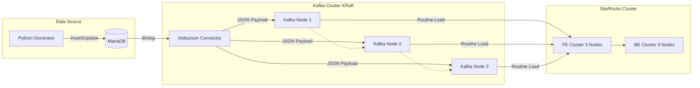

# 🚀 Real-time Event Data Pipeline (High-Availability Cluster)


## 📖 프로젝트 개요

이 프로젝트는 **CDC(Change Data Capture)**와 **OLAP(StarRocks)** 기술을 활용하여 구축한 **고가용성(High-Availability) 실시간 데이터 파이프라인**입니다.

단일 장애 지점(SPOF)을 제거하기 위해 Kafka와 StarRocks를 모두 **3-Node 클러스터**로 구성하였으며, 데이터의 생성부터 분석용 DB 적재까지의 지연 시간을 최소화하는 **Real-time Analytics** 환경을 구현하는 것을 목표로 합니다.

### 🎯 핵심 목표
* **Zero-ETL**: 복잡한 배치 처리 없이 `Routine Load`를 통해 Kafka 데이터를 StarRocks로 직접 적재.
* **Schema-less CDC**: Debezium의 JSON 변환(Schema 제외)을 통해 유연한 데이터 수집.
* **Robust Infrastructure**: 고정 IP 기반의 Docker Network와 클러스터링을 통한 안정성 확보.

---

## 🏗️ 시스템 아키텍처 (Architecture)



### 🛠️ 기술 스택 및 버전

| Component | Version | Description |
| :--- | :--- | :--- |
| **StarRocks** | 4.x | FE(3) + BE(3) MPP Architecture |
| **Apache Kafka** | 7.6.1 | KRaft Mode (No Zookeeper), 3 Brokers |
| **Debezium** | 2.4 | Kafka Connect 기반 CDC (JSON Converter) |
| **MariaDB** | 10.6 | Source OLTP Database |
| **Python** | 3.9+ | Fake Data Generator |
| **Docker** | Compose | Container Orchestration (Static IP) |

---

## ⚠️ 사전 요구 사항 (Prerequisites)

이 프로젝트는 고성능 데이터베이스와 메시지 큐를 다수 구동하므로 호스트 머신의 커널 설정 변경이 필수적입니다.

**1. 가상 메모리 설정 (필수)**
StarRocks BE와 Kafka의 정상 작동을 위해 호스트의 `vm.max_map_count`를 늘려야 합니다.

```bash
# Linux / macOS (Intel) / WSL2
sudo sysctl -w vm.max_map_count=262144
```

**2. 하드웨어 리소스 권장 사양**
총 10개 이상의 컨테이너(Java 기반 다수)가 구동되므로 아래 사양을 권장합니다.
* **RAM**: 16GB 이상
* **CPU**: 6 vCPU 이상

---

## 🗺️ 클러스터 명세 (Cluster Map)

모든 컨테이너는 `dataplatform-net` (`10.100.0.0/16`) 네트워크 내에서 고정 IP를 가집니다.

| Role | Service Name | IP Address | Port (Internal/External) |
| :--- | :--- | :--- | :--- |
| **Kafka** | kafka-1 | 10.100.0.41 | 9092, 29092 |
| | kafka-2 | 10.100.0.42 | 9093, 29092 |
| | kafka-3 | 10.100.0.43 | 9094, 29092 |
| | kafka-ui | 10.100.0.44 | 8080 (Web) |
| **StarRocks** | starrocks-fe-0 (Leader) | 10.100.0.21 | 9030 (Query), 8030 (Web) |
| | starrocks-fe-1 | 10.100.0.22 | - |
| | starrocks-fe-2 | 10.100.0.23 | - |
| | starrocks-be-0 | 10.100.0.31 | 9050 (Heartbeat), 8040 (Web) |
| | starrocks-be-1 | 10.100.0.32 | - |
| | starrocks-be-2 | 10.100.0.33 | - |
| **Source** | mariadb-source | (Auto) | 3306 |
| **CDC** | debezium-connector | (Auto) | 8083 |

---

## 🚀 실행 가이드 (Quick Start)

의존성 문제 방지를 위해 반드시 아래 순서대로 실행해 주세요.

### Step 1. 네트워크 생성
고정 IP 할당을 위한 서브넷이 지정된 네트워크를 생성합니다.

```bash
sh create_network.sh
# 또는 직접 실행: docker network create --driver bridge --subnet=10.100.0.0/16 dataplatform-net
```

### Step 2. Kafka 클러스터 구동
메시지 브로커를 가장 먼저 실행합니다. (KRaft 모드)

```bash
cd kafka
docker-compose up -d

# 3개의 브로커가 모두 Healthy 상태가 될 때까지 약 30초 대기
```
> **확인**: 브라우저에서 `http://localhost:8080` (Kafka UI) 접속하여 클러스터 상태 확인.

### Step 3. MariaDB & Debezium 구동

```bash
cd ../mariadb
docker-compose up -d

cd ../debezium
docker-compose up -d
```

### Step 4. StarRocks 클러스터 구동
FE(Frontend)를 먼저 띄우고 BE(Backend)를 실행합니다.

**FE 실행:**
```bash
cd ../starrocks/fe
docker-compose up -d
```

**BE 실행:**
```bash
cd ../be
docker-compose up -d
```

### Step 5. StarRocks 클러스터 구성 (Backend 추가)
Docker 실행 직후에는 FE가 BE를 인식하지 못할 수 있습니다. FE Leader에 접속하여 BE 노드들을 클러스터에 등록합니다.

**MySQL 클라이언트로 FE 접속:**
```bash
mysql -h 127.0.0.1 -P 9030 -u root
```

**BE 노드 추가 쿼리 실행:**
```sql
ALTER SYSTEM ADD BACKEND "10.100.0.31:9050";
ALTER SYSTEM ADD BACKEND "10.100.0.32:9050";
ALTER SYSTEM ADD BACKEND "10.100.0.33:9050";

-- 상태 확인 (Alive가 true여야 함)
SHOW BACKENDS;
```

### Step 6. 파이프라인 연결 (Connector & Routine Load)

**1. Debezium Connector 등록**
API를 호출하여 MariaDB를 바라보는 커넥터를 생성합니다.

```bash
cd ../../debezium
sh register_connector.sh
```

**2. StarRocks 테이블 및 Routine Load 생성**
StarRocks FE(MySQL Client)에서 아래 쿼리를 실행합니다.

```sql
-- DB 생성
CREATE DATABASE IF NOT EXISTS demo_db;
USE demo_db;

-- 1. 테이블 생성 (분석용 스키마)
CREATE TABLE events (
    id BIGINT,
    event_type STRING,
    created_at DATETIME
) ENGINE=OLAP
PRIMARY KEY(id)
DISTRIBUTED BY HASH(id) BUCKETS 3
PROPERTIES("replication_num" = "3");

-- 2. Routine Load 생성 (Kafka -> StarRocks)
CREATE ROUTINE LOAD event_load ON events
COLUMNS(id, event_type, created_at)
PROPERTIES
(
    "format" = "json",
    "jsonpaths" = "[\"$.id\", \"$.event_type\", \"$.created_at\"]"
)
FROM KAFKA
(
    "kafka_broker_list" = "10.100.0.41:9092,10.100.0.42:9092,10.100.0.43:9092",
    "kafka_topic" = "mariadb.demo_db.events",
    "property.group.id" = "starrocks_consumers"
);
```

### Step 7. 데이터 생성 (테스트)
Python 스크립트로 MariaDB에 데이터를 넣으면 파이프라인 전체가 작동합니다.

```bash
cd mariadb
# 가상환경이 있다면 source venv/bin/activate
python gen_data.py
```

---

## 📊 모니터링 및 문제 해결

* **데이터가 적재되지 않을 때:**
    * StarRocks에서 `SHOW ROUTINE LOAD TASK WHERE JobName = 'event_load';` 명령어로 에러 로그(`ErrorMsg`)를 확인하세요.
    * Kafka Topic에 데이터가 들어오는지 Kafka UI(`localhost:8080`)에서 확인하세요.
* **BE 노드가 죽을 때:**
    * `docker logs starrocks-be-0` 확인. Memory Limit Exceeded 관련 로그가 있다면 호스트의 메모리를 늘리거나 `vm.max_map_count` 설정을 다시 확인하세요.
* **Apple Silicon (M1/M2) 사용자:**
    * StarRocks BE 이미지는 AVX2 명령어를 사용하므로, ARM 아키텍처에서는 실행이 실패하거나 매우 느릴 수 있습니다 (Rosetta 2 필요 혹은 ARM 호환 이미지 사용 권장).

## 📝 주요 설정 노트

* **Debezium 설정**: `CONNECT_VALUE_CONVERTER_SCHEMAS_ENABLE=false`로 설정되어 있어 Kafka 메시지는 스키마 없는 순수 JSON 형태로 전송됩니다. 이는 Routine Load 시 JSON Path 파싱을 용이하게 합니다.
* **로그 관리**: 각 컨테이너는 `json-file` 드라이버를 사용하며 `max-size: 200m`로 설정되어 있어 디스크 과점유를 방지합니다.
